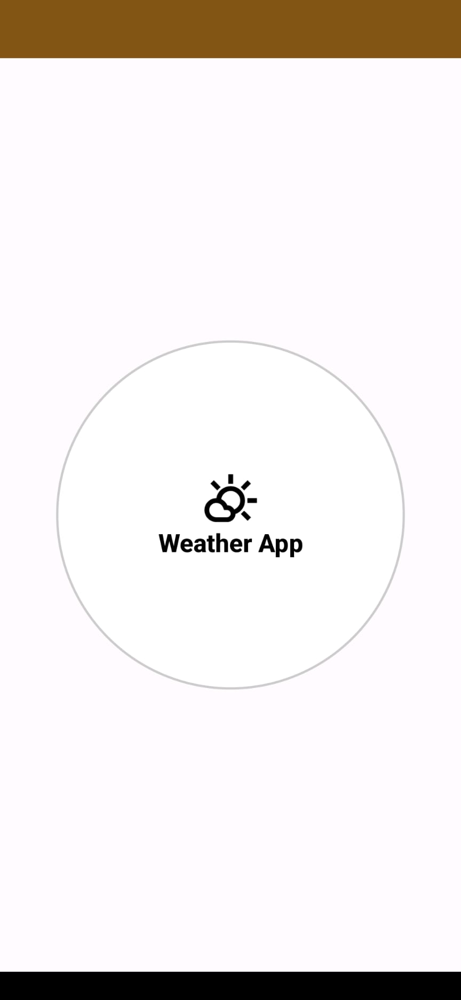
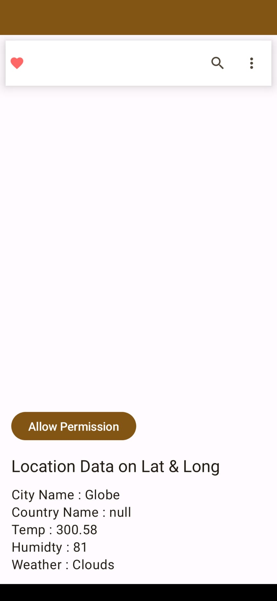
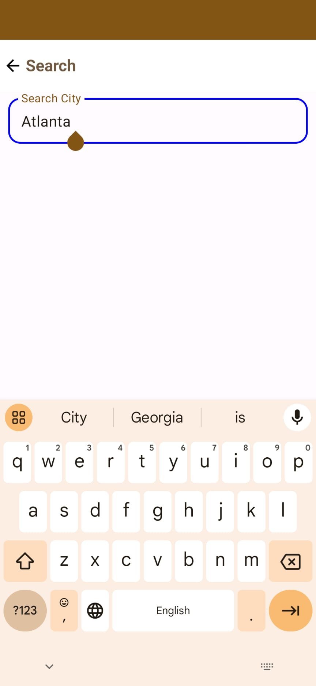
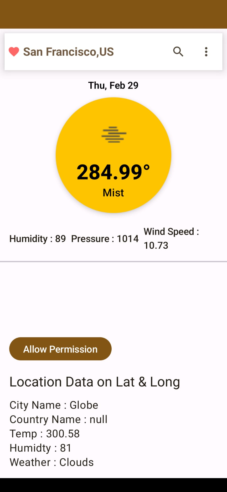

# weathersearchbycity
weather app search by city
## clone repository from github
        https://github.com/ManasaLakshmiB/myandroidweatherapp.git
## running instructions
   1. import project to Android Studio Hedgehog | 2023.1.1 Patch 2
   2. run the app in emulator
## use cases
  1. open the app and enter city name in text box by clicking search icon
  2. check weather details in the page
![img_3.png](img_3.png)